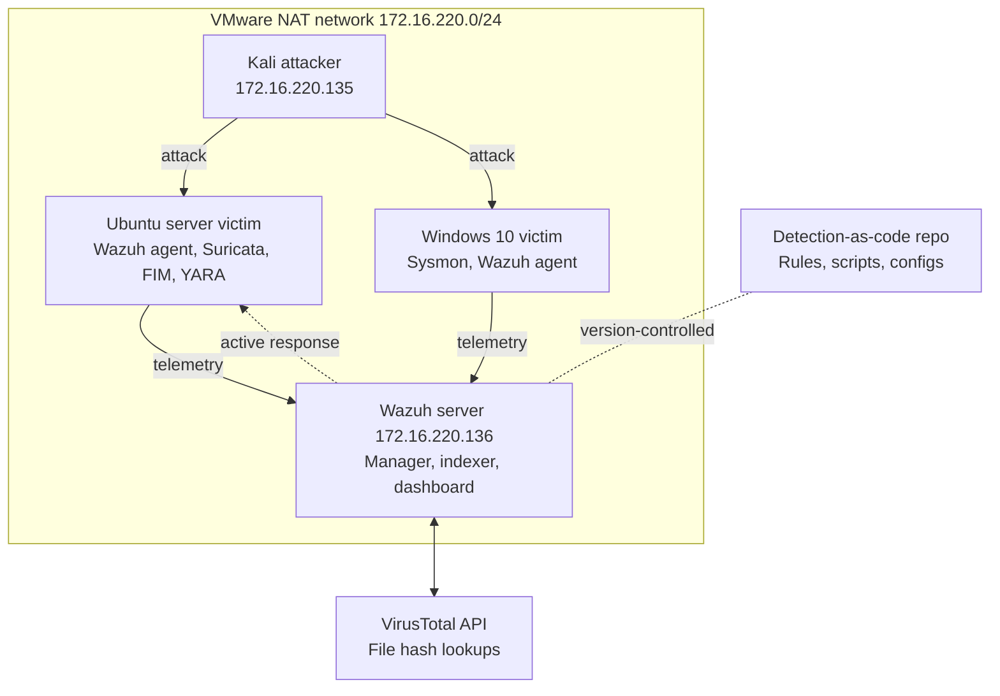

# Wazuh SOC Lab: Threat Detection & Automated Response

A four-VM home lab that simulates a small SOC pipeline end to end: **attack → telemetry → detection → enrichment → automated response**. Everything that makes a detection work (rules, decoders, scripts, configs) is version-controlled in this repo, so the lab can be rebuilt and the demo re-run from scratch.

> **Status:** 🚧 In progress. Sections marked `TODO` are filled in as each phase is completed and tested.

---

## Table of contents

1. [Goals](#goals)
2. [Architecture](#architecture)
3. [Lab inventory](#lab-inventory)
4. [Data flow](#data-flow)
5. [Design decisions](#design-decisions)
6. [Detection coverage (MITRE ATT&CK)](#detection-coverage-mitre-att&ck)
7. [Automated response](#automated-response)
8. [Attack scenarios](#attack-scenarios)
9. [Results](#results)
10. [Repository layout](#repository-layout)
11. [Setup](#setup)
12. [Reproducing the demo](#reproducing-the-demo)
13. [Lessons learned](#lessons-learned)
14. [Disclaimer](#disclaimer)

---

## Goals

- Build a working **SIEM/XDR pipeline** with Wazuh across Linux and Windows endpoints.
- Write **custom detection rules** and map each one to a MITRE ATT&CK technique.
- Combine multiple telemetry sources: host logs, **FIM**, **Sysmon**, **Suricata** network alerts and **YARA** scans.
- Enrich alerts with **VirusTotal** file-hash lookups.
- Implement **active response** on Linux (block IP, lock account, quarantine file) and measure detection-to-response time.
- Treat detections as code: everything is in Git, tested against repeatable attacks, and documented.

---

## Architecture


All four VMs sit on a single VMware NAT network, `172.16.220.0/24`.



**Legend:** solid orange = attack · solid grey = telemetry · dashed green = active response · dotted grey = version-controlled.

---

## Lab inventory

| VM | Role | IP | RAM | Key components |
|----|------|----|-----|----------------|
| Wazuh server | SIEM / XDR | `172.16.220.136` | 8 GB | Manager, indexer, dashboard |
| Ubuntu server | Linux victim | `TODO` | 2 GB | Wazuh agent, Suricata, FIM, YARA |
| Windows 10 | Windows victim | `TODO` | 4 GB | Wazuh agent, Sysmon |
| Kali Linux | Attacker | `172.16.220.135` | 2–4 GB | Hydra, Atomic Red Team (Invoke-AtomicRedTeam), nmap |

**Host budget:** 16–18 GB allocated to VMs, leaving roughly 6 GB for the host OS.

---

## Data flow

1. **Kali → victims.** Kali attacks both victims directly. Hydra (credential attacks) and Atomic Red Team tests are the main tools.
2. **Victims → Wazuh.** Both victims run the Wazuh agent. The Ubuntu host also runs Suricata, FIM and YARA; the Windows host runs Sysmon. Everything ships to the manager on ports **1514** (event forwarding) and **1515** (agent enrollment).
3. **Wazuh → VirusTotal.** When FIM sees a new or changed file, Wazuh looks up its hash through the VirusTotal integration.
4. **Wazuh → Ubuntu (active response).** When a rule fires, the manager instructs the agent to drop an IP, lock an account or quarantine a file. **The response commands execute on the victim, not on the Wazuh server.**

---

## Design decisions

| Decision | Why |
|----------|-----|
| **Suricata runs on the Ubuntu victim** | A NAT network offers no SPAN/mirror port, so a standalone sensor would see nothing. Running Suricata on the host lets it watch traffic aimed at that host and write `eve.json` locally, which the Wazuh agent reads. |
| **Automated response on Linux only** | Windows stays detection and investigation only (Sysmon plus parent-child process rules). This keeps the demo reliable and avoids locking myself out of the Windows VM. |
| **Whitelist before testing** | The Wazuh server (`.136`), the gateway and my own admin IP go into the active response ignore list. Kali (`.135`) is the only IP that should ever be blocked. |
| **Snapshots at every milestone** | A clean state per phase makes the demo repeatable and makes re-recording video takes painless. |
| **Detection-as-code** | Rules, decoders, response scripts and config snippets live in Git, so every change is reviewable and the lab can be rebuilt. |

---

## Detection coverage (MITRE ATT&CK)

> Planned coverage. The *Status* column is updated as each detection is built and verified.

| Tactic | Technique | Attack simulated | Telemetry source | Detection | Response | Status |
|--------|-----------|------------------|------------------|-----------|----------|--------|
| Credential Access | T1110.001 Password Guessing | Hydra SSH brute force from Kali | Linux auth logs | Wazuh SSH brute-force rule (custom escalation) | Block source IP | ☐ |
| Discovery | T1046 Network Service Discovery | nmap scan from Kali | Suricata (`eve.json`) | Suricata scan signatures forwarded to Wazuh | Block source IP | ☐ |
| Persistence | T1505.003 Web Shell | Drop a PHP webshell in the web root | FIM + YARA | FIM new-file alert, YARA webshell match | Quarantine file | ☐ |
| Command and Control / Execution | T1105 Ingress Tool Transfer | Download an ELF payload | FIM + YARA + VirusTotal | New-file alert, YARA ELF match, VT verdict | Quarantine file | ☐ |
| Persistence | T1136.001 Create Account | Add a rogue local user | Linux auth / audit logs | Custom user-creation rule | Lock account | ☐ |
| Execution | T1059.001 PowerShell | Atomic Red Team PowerShell tests | Sysmon (EID 1) | Parent-child process rule | Detection only | ☐ |
| Persistence | T1547.001 Registry Run Keys | Atomic Red Team run-key test | Sysmon (EID 12/13) | Registry modification rule | Detection only | ☐ |
| Persistence | T1053.005 Scheduled Task | Atomic Red Team schtasks test | Sysmon (EID 1) | Process creation rule | Detection only | ☐ |

`TODO`: adjust the table to match the final rule set, and add Wazuh rule IDs.

---

## Automated response

Active response runs **on the Ubuntu agent**, triggered by the manager.

| Trigger | Action | Implementation |
|---------|--------|----------------|
| SSH brute force / port scan | Drop attacker IP | Built-in `firewall-drop`, with a timeout |
| Rogue account creation or abuse | Lock the account | Custom `lock-user` script in [`active-response/`](active-response/) |
| Malicious file (YARA or VirusTotal hit) | Quarantine the file | Quarantine script, tweaked from the Wazuh stock approach |

### Safety rails

- The ignore list contains the Wazuh server, the gateway and the admin workstation.
- Every block has a **timeout** so a false positive cannot lock out an address forever.
- Only Kali (`172.16.220.135`) is intended to be blocked during testing.

---

## Attack scenarios

The exact commands for each stage are kept in [`attacks/`](attacks/), so every run is reproducible.

| # | Scenario | Target | Tools |
|---|----------|--------|-------|
| 1 | SSH brute force | Ubuntu | Hydra |
| 2 | Port and service scan | Ubuntu | nmap, Suricata |
| 3 | Webshell drop | Ubuntu | Manual file write, FIM, YARA |
| 4 | Malicious binary drop | Ubuntu | FIM, YARA, VirusTotal |
| 5 | Rogue user creation | Ubuntu | `useradd` |
| 6 | Windows post-exploitation techniques | Windows 10 | Atomic Red Team, Sysmon |

`TODO`: link each scenario to its script and its evidence.

---

## Results

> Filled in after testing. Screenshots and timing data live in [`evidence/`](evidence/).

| Scenario | Detected | Rule ID | Time to detect | Time to respond | Evidence |
|----------|----------|---------|----------------|-----------------|----------|
| SSH brute force | `TODO` | `TODO` | `TODO` | `TODO` | `TODO` |
| Port scan | `TODO` | `TODO` | `TODO` | `TODO` | `TODO` |
| Webshell drop | `TODO` | `TODO` | `TODO` | `TODO` | `TODO` |
| Malicious binary | `TODO` | `TODO` | `TODO` | `TODO` | `TODO` |
| Rogue user | `TODO` | `TODO` | `TODO` | `TODO` | `TODO` |
| Windows (Atomic tests) | `TODO` | `TODO` | `TODO` | n/a | `TODO` |

**Demo video:** `TODO: link`

---

## Repository layout

```
wazuh-soc-lab/
├── README.md            Architecture diagram, results, ATT&CK table
├── rules/               local_rules.xml, custom decoders
├── active-response/     lock-user script, quarantine tweaks
├── configs/             ossec.conf snippets, sysmon.xml, suricata.yaml
├── yara/                Webshell and ELF rules
├── attacks/             Exact commands for each stage
└── evidence/            Screenshots, timing results
```

---

## Setup

High-level build order. Take a **VM snapshot after each phase**.

1. **Network.** Create the VMware NAT network `172.16.220.0/24` and give the Wazuh server and Kali static or reserved addresses (`.136` and `.135`).
2. **Wazuh server.** Install the all-in-one deployment (manager, indexer, dashboard). Confirm agents can reach ports 1514 and 1515.
3. **Ubuntu victim.** Install the Wazuh agent, then Suricata (write `eve.json` locally and add it as a `<localfile>`), configure FIM on the target directories, and install YARA.
4. **Windows victim.** Install Sysmon with the config from [`configs/sysmon.xml`](configs/), then the Wazuh agent. Collect the Sysmon operational channel.
5. **Rules and decoders.** Copy [`rules/`](rules/) into `/var/ossec/etc/rules/` and restart the manager.
6. **VirusTotal.** Add the integration block to the manager's `ossec.conf` with your API key.
7. **Active response.** Install the scripts from [`active-response/`](active-response/), register the commands and responses, and set the ignore list **before** running any attack.
8. **Kali.** Install Hydra, nmap and Invoke-AtomicRedTeam tooling.

> ⚠️ **Secrets:** never commit your VirusTotal API key or Wazuh credentials. Keep them in local, git-ignored config and publish only sanitized snippets.

---

## Reproducing the demo

1. Revert all VMs to the clean snapshot for the phase you want to demo.
2. Confirm both agents show **Active** in the Wazuh dashboard.
3. Confirm the active response ignore list is in place.
4. Run the scenario scripts from [`attacks/`](attacks/) in order.
5. Watch the alerts appear in the dashboard, then verify the response on the Ubuntu victim (for example, check the firewall rules for the dropped IP).
6. Record timings in [`evidence/`](evidence/).

---

## Lessons learned

`TODO`: fill in as you build. Good candidates: NAT limits on network monitoring, tuning noisy rules, YARA false positives, and active response edge cases.

---

## Disclaimer

This lab is for **educational purposes** and runs entirely in an isolated virtual network that I own. Do not use these techniques against systems you do not own or have explicit permission to test.

---

## Author

**Yassine Nemri**: [GitHub](https://github.com/Yassine1Nemri)

Repository: <https://github.com/Yassine1Nemri/Wazuh-SOC-project-Threat-Detection-Automated-Response>
